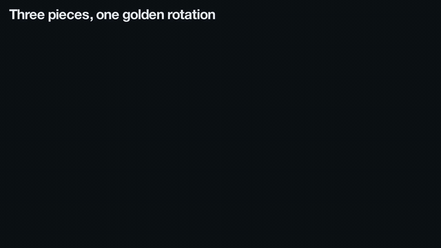

# The critical radius of the two-disk group GG₅

[](https://github.com/eric-vergo/critical-radius-five/actions/workflows/ci.yml)
[](https://github.com/eric-vergo/critical-radius-five/actions/workflows/blueprint.yml)

A formal proof, in [Lean 4](https://lean-lang.org) with [Mathlib](https://github.com/leanprover-community/mathlib4),
that the two-disk compound symmetry group GG₅(r) is finite exactly when r < √(3 + φ). Its
critical radius is therefore

  **r_c(5) = √(3 + φ) = 2.1489611417…**, where φ = (1 + √5)/2 is the golden ratio
  (√(3 + φ) is a root of x⁴ − 7x² + 11).

This is the value found numerically by Hearn, Kretschmer, Rokicki, Streeter and Vergo,
[*Two-Disk Compound Symmetry Groups*](https://arxiv.org/abs/2302.12950) (arXiv:2302.12950). They
proved that the group is infinite at √(3 + φ) (their Theorem 2). That the group is finite for every
smaller radius is proved here.



*At r = √(3 + φ) three words exchange the three pieces of a chord; glued into a circle, the
exchange is a rotation by 1/φ of a turn, so the orbit of the origin never closes
([more animations](animations/)).*

## The statement

Two closed disks of radius `r` are centred at `-1` and `1` in the complex plane. The generator `a`
turns the left disk clockwise by `2π/n` and fixes every point outside it. The generator `b` does the
same with the right disk. `GG n r` is the group of permutations of `ℂ` generated by `a` and `b`, and
`criticalRadius n` is the supremum of the radii at which it is finite. In Lean, excerpted from
[`Challenge.lean`](Challenge.lean):

```lean
def turn (c : ℂ) (r θ : ℝ) : Equiv.Perm ℂ where
  toFun z := if ‖z - c‖ ≤ r then c + exp (θ * I) * (z - c) else z
  invFun z := if ‖z - c‖ ≤ r then c + exp (-θ * I) * (z - c) else z
  ...

def genA (n : ℕ) (r : ℝ) : Equiv.Perm ℂ := turn (-1) r (-(2 * Real.pi / n))
def genB (n : ℕ) (r : ℝ) : Equiv.Perm ℂ := turn 1 r (-(2 * Real.pi / n))
def GG (n : ℕ) (r : ℝ) : Subgroup (Equiv.Perm ℂ) := Subgroup.closure {genA n r, genB n r}
def criticalRadius (n : ℕ) : ℝ := sSup {r : ℝ | Finite (GG n r)}

theorem finite_GG_five_iff (r : ℝ) : Finite (GG 5 r) ↔ r < √(3 + φ)
theorem criticalRadius_five : criticalRadius 5 = √(3 + φ)
```

The second theorem follows from the first. The first also says that the group is infinite at the
critical radius itself, and it does not depend on the convention that `sSup` of an unbounded set is
`0`.

## The proof in one page

Write `ζ = exp(2πi/5)`. Every point reached from the origin lies in the lattice `ℤ[ζ₅]`, and all the
lengths that matter lie in `ℚ(φ)`, so the proof works with exact arithmetic throughout.

**Infinite at √(3 + φ)** ([`UpperBound`](CriticalRadiusFive/UpperBound.lean)). Let `E = ζ − ζ²`, so
that `‖E + 1‖ = √(3 + φ)`: at this radius the chord `E'E` from `−E` to `E`, which passes through the
origin, just fits into the lens where the two disks overlap. Three words translate three pieces of
the chord:

| word | piece of the chord `s·E` | translation |
|---|---|---|
| `a⁻¹a⁻¹b⁻¹a⁻¹b⁻¹` | `−1 ≤ s ≤ 1 − φ` | `(2φ − 2)·E` |
| `abab²` | `1 − φ ≤ s ≤ 3 − 2φ` | `(2φ − 2)·E` |
| `abab⁻¹a⁻¹b⁻¹` | `3 − 2φ ≤ s ≤ 1` | `(2φ − 4)·E` |

Each word is checked at the two endpoints of its piece. The endpoints are lattice points, and every
disk test is an inequality in `ℤ[φ]` decided by integer arithmetic (`decide`). Convexity of the
disks carries the check over to the whole piece. On the parameter `s` the three words make up the
rotation `s ↦ s + 2/φ` of the circle `[−1, 1)`, whose rotation number `1/φ` is irrational. So the
orbit of the origin is infinite.

**Finite below √(3 + φ)** ([`PivotWalk`](CriticalRadiusFive/PivotWalk.lean),
[`LowerBound`](CriticalRadiusFive/LowerBound.lean)).

1. *Pivots.* Every element of the group moves a point `p` to `m(p + 1 − 2ν) − 1`, with `m` a fifth
   root of unity and a *pivot* `ν ∈ ℤ[ζ₅]`. The pivot `ν` and its *tip* `ν + m̄` are the ends of a
   unit dumbbell; a letter turns the dumbbell about one end, and only if that end lies in the
   *window* `‖p + 1 − 2ν‖ ≤ r`. So the ends walk on `ℤ[ζ₅]` by steps `+μ₅` (pivot to tip) and `−μ₅`
   (tip to the next pivot); as 5 is odd, `−μ₅ ≠ μ₅`, and pivots and tips fall into two classes, 0
   and 1, modulo the prime `1 − ζ`.
2. *Levels.* Let `u = 1 − ζ + ζ²` and `ψ(ν) = 2 Re(ū ν) = A + Bφ`. The integer
   *level* `ℓ = −A − 3B` satisfies `ψ + ℓ = −(3 − φ)·B`. So the values of `ψ` at a given level form a
   progression of period `δ = 3 − φ`. A step changes the level by `+3` or `−2` from a pivot and by
   `−3` or `+2` from a tip, and the only steps that can cross a level `5q` are those in the two
   *active* directions.
3. *The lens.* Only steps between two points of the window matter. For an active step between two
   window points, the midpoint lies in the lens where two disks of radius `r` overlap, which
   confines `ψ` of its pivot to a strip of width `2L(r) = √(7 − 4φ)·√(r² − 1)`. For `r ≥ 1` that
   width is less than `δ` exactly when `r² < 3 + φ`.
4. *Cut levels.* As `q` varies, the progression at level `5q` is shifted by `−5`, that is by
   `−(2 + φ)` periods: an irrational rotation. Dirichlet's approximation theorem then gives *cut
   levels*, at which the strip misses the progression, on both sides and within a bound that
   depends on `r` alone. No step between two points of the window crosses a cut level, so their
   levels are bounded. The same holds for the turned functional `ψ(ζ⁻¹·)`.
5. *Discreteness.* The golden parts `B` of the two functionals (bounded, since `δB = −(ψ + ℓ)`) and
   their two levels are four integers that determine the pivot through an integer matrix of
   determinant `−5`, so every pivot lies in a box whose size depends on `r` only, and every orbit
   lies in a finite set whose size depends on `r` only. A group generated by finitely many
   permutations whose orbits are uniformly bounded is finite
   ([`Finiteness`](CriticalRadiusFive/Finiteness.lean)).

## Module map

| module | lines | content |
|---|---:|---|
| [`Defs`](CriticalRadiusFive/Defs.lean) | 71 | the turns, the generators, `GG n r`, `criticalRadius n` (for all `n`), copied verbatim in `Challenge.lean` |
| [`Basic`](CriticalRadiusFive/Basic.lean) | 148 | how the generators act; the invariance principle; points off the disks are fixed |
| [`Finiteness`](CriticalRadiusFive/Finiteness.lean) | 163 | bounded orbits imply finiteness; orbits grow with `r`; finiteness is monotone; the critical radius as a threshold |
| [`CircleRotation`](CriticalRadiusFive/CircleRotation.lean) | 184 | irrational rotations: no return (infinite orbits) and cut levels (Dirichlet) |
| [`Words`](CriticalRadiusFive/Words.lean) | 149 | words in `a^{±1}, b^{±1}`; admissibility; words acting on segments |
| [`Cyclotomic`](CriticalRadiusFive/Cyclotomic.lean) | 299 | `ζ₅`, the lattice `ℤ[ζ₅]` in the power basis, the norm form, an integer sign test for `x + yφ` |
| [`UpperBound`](CriticalRadiusFive/UpperBound.lean) | 254 | Theorem 2: the three words, the golden rotation of the chord, `infinite_GG_five` |
| [`Lens`](CriticalRadiusFive/Lens.lean) | 100 | the lens bound |
| [`PivotWalk`](CriticalRadiusFive/PivotWalk.lean) | 150 | the typed pivot walk as an orbit invariant |
| [`LowerBound`](CriticalRadiusFive/LowerBound.lean) | 482 | the cut functional and its levels, the lens window, cut levels, discreteness, `finite_GG_five_of_lt` |
| [`Main`](CriticalRadiusFive/Main.lean) | 43 | `finite_GG_five_iff`, `criticalRadius_five` |

## Reading guide

[`Check.lean`](Check.lean) unfolds the five definitions of `Challenge.lean` (`turn_apply_check`,
`genA_apply_check`, `genB_apply_check`, `genA_apply_of_not_check`, `genB_apply_of_not_check`,
`GG_check`, `criticalRadius_check`) and restates the two theorems in fully elementary terms
(`finite_iff_check`, `criticalRadius_check_five`); every proof there is `rfl`, a one-line unfolding,
or a direct appeal to the library. `lake build` compiles it (it is a default target).

The proof architecture, with every statement linked to its Lean declaration and an interactive
dependency graph, is the Verso blueprint in [`blueprint/`](blueprint/), published at
<https://eric-vergo.github.io/critical-radius-five/>. A short expository paper is in
[`paper/`](paper/) (`main.pdf`), the animations in [`animations/`](animations/), and the
dependency-graph poster in [`poster/`](poster/).

## Building and checking

Requirements: [elan](https://github.com/leanprover/elan). The toolchain (`leanprover/lean4:v4.34.0`)
and the Mathlib commit (`5ed2965256430c3649e86755f9576b54eca72435`) are pinned in `lean-toolchain`
and `lake-manifest.json`.

```sh
lake exe cache get   # download the prebuilt Mathlib
lake build           # the library, Challenge, Solution, the axiom audit Test and Check (about a minute)
lake lint            # the Batteries/Mathlib environment linters, on the same modules
```

`lake exe cache get` may report that a few files were not found in the cache (at this Mathlib
commit, `Mathlib.Probability.Kernel.Invariance` and `Mathlib`); this is harmless, and `lake build`
compiles them in a few seconds.

`lake build` reports the deliberate `sorry` of the two statements in `Challenge.lean` and nothing
else. It fails if [`Test.lean`](Test.lean) finds any axiom other than the three standard ones:

```
'criticalRadius_five' depends on axioms: [propext, Classical.choice, Quot.sound]
'finite_GG_five_iff' depends on axioms: [propext, Classical.choice, Quot.sound]
```

The library has no `sorry`, no `native_decide` and no axioms of its own.

## Independent verification with the comparator

The Lean FRO [comparator](https://github.com/leanprover/comparator) checks a solution against a
trusted statement without trusting the solution's build. [`comparator.json`](comparator.json) names
the two theorems:

- [`Challenge.lean`](Challenge.lean) imports only Mathlib. It repeats the definitions of
  [`Defs.lean`](CriticalRadiusFive/Defs.lean) verbatim and states the two theorems with `sorry`.
  This file, 74 lines, is all a reader needs to audit.
- [`Solution.lean`](Solution.lean) imports the library and restates the two theorems with their
  proofs.

On Linux the comparator builds and exports both modules, and replays the export with nanoda, inside
a [landrun](https://github.com/Zouuup/landrun) sandbox; the Lean kernel replays it in the
comparator's own process. It checks four things:

- every constant the statements use, definitions included, is literally the same in the two
  environments, so the library's definitions *are* the challenge's;
- the statements coincide;
- the proofs use only `propext`, `Quot.sound` and `Classical.choice`;
- the Lean kernel and the independent [nanoda](https://github.com/robsimmons/nanoda_lib) kernel both
  accept the solution when they replay it.

```sh
./scripts/verify-comparator.sh
```

Requirements: git, python3, cargo and elan, and on Linux also go (for landrun). The script builds
pinned revisions of the comparator, lean4export, nanoda and landrun. It needs Linux
(landrun uses Landlock), as in CI. On other systems it runs only with
`COMPARATOR_ALLOW_UNSANDBOXED=1`, and then substitutes the comparator's `fake-landrun.sh`. The
comparison, the axiom check and both kernel replays are unchanged in that mode; only the sandbox is
lost.

**Verified locally** (macOS, unsandboxed mode), reproduced on a fresh clone at tag `v1.0` whose
`.lake` held only Mathlib:

- `lake build` and `lake lint` pass.
- The axiom audit passes.
- The comparator reports `nanoda kernel accepts the solution`, `Lean default kernel accepts the
  solution` and `Your solution is okay!`.

**Continuous integration** ([`.github/workflows/ci.yml`](.github/workflows/ci.yml)) builds the
project, runs the linters and the axiom audit, runs the comparator under landrun, and checks that no
`sorry` occurs outside `Challenge.lean`. The sandboxed Linux comparator job and the hygiene job
passed on commit `39b3e01`; the build job and the Pages deployment are re-run on every push.

## Repository layout

- `CriticalRadiusFive/`: the library (above)
- `Challenge.lean`, `Solution.lean`, `comparator.json`: the statement and its check by the comparator
- `Test.lean`: the axiom audit
- `Check.lean`: the reading guide (above)
- `formalization.yaml`: the project card (Mathlib Initiative schema v0.4, Palomar registry layout)
- `scripts/`: the comparator and landrun wrapper scripts
- `blueprint/`, `paper/`, `poster/`, `animations/`: the blueprint, the paper, the dependency-graph
  poster and the animations, each with its own README

## License

Apache License 2.0, see [LICENSE](LICENSE). Copyright 2026 The critical-radius-five authors.
